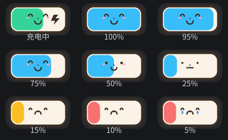

# Fox Battery（狐狸电池）

**可爱又实用的 GNOME 电池扩展**



**把顶栏的电池，变成一只会说话的小狐狸**

**Fox Battery** 是一款 GNOME Shell 扩展，用可爱的卡通狐狸替换系统默认电池图标，并在设置面板中提供 **充电上限**（80% / 90% / 100%）与 **界面语言** 控制。专为小米 / 红米笔记本设计，基于 **acpi_call + WMI** 实现硬件级充电控制。

## 预览

| 电量状态 | 充电中 |
|---|---|
|  |  |

| 100% | 75% | 50% | 25% |
|---|---|---|---|
|  |  |  |  |

## 功能特色

### 开箱即用

| ✅ **一键替换图标** | 启用扩展后，顶栏与快捷设置面板的电池图标立即变成狐狸，无需任何配置 |
|---|---|
| ✅ **锁屏同样生效** | 锁屏界面（Super+L）下顶栏保持显示，狐狸图标照常工作 |
| ✅ **界面语言切换** | 设置面板内置 **跟随系统 / 中文 / 英文** 三档语言，切换即时生效 |

### 狐狸电池图标

| 特性 | 说明 |
|---|---|
| 🦊 **卡通狐狸造型** | 固定 2:1 比例的狐狸电池，充电时绿色填充 + 闪电标识 |
| 🔋 **实时电量** | 直接读取内核 `/sys/class/power_supply/BAT0/`，绕过 UPower 约 20 秒的延迟判定，状态秒级同步 |
| 📱 **随缩放适配** | 自动跟随 HiDPI 缩放因子渲染，面板 / 快捷设置两处尺寸独立适配 |

### 充电上限

| 档位 | 说明 |
|---|---|
| **100%** | 不限制（默认充满） |
| **90%** | 充至 90% 停止（延长电池寿命） |
| **80%** | 充至 80% 停止（最长寿命） |

- 设置即时生效，并**持久化保存**到 `/etc/battery-limit.conf`
- **开机自动套用**（systemd 服务）
- **插拔充电器自动重新套用**（udev 规则，EC 在插拔时会重置限制）

## 工作原理

```
┌─────────────────────────────────────────────────────────┐
│ Fox Battery (GNOME Shell 扩展)                          │
├──────────────────────────────┬──────────────────────────┤
│ 狐狸图标渲染                  │ 充电上限控制               │
│ Canvas 绘制 foxicon          │ battery-limit.sh          │
│  ───────────────             │  ─────────────            │
│ 顶栏 / 快捷设置 / 锁屏        │ acpi_call 模块             │
│ 状态读取                      │   └→ /proc/acpi/call      │
│  /sys/class/power_supply/    │       └→ WMI WMAA 方法      │
│      BAT0/{capacity,status}  │           └→ EC 充电控制    │
└──────────────────────────────┴──────────────────────────┘
```

| 层级 | 技术 |
|---|---|
| **扩展框架** | GNOME Shell Extension API（兼容 Shell 45 – 50） |
| **图标绘制** | Clutter Canvas / SVG 矢量狐狸 |
| **充电上限** | [acpi_call](https://github.com/mkottman/acpi_call) 内核模块 + `\_SB.PC00.WMID.WMAA` WMI 方法 |
| **状态读取** | 内核 sysfs（`capacity` / `status`），不依赖 UPower 延迟判定 |
| **持久化** | systemd 服务 + udev 规则 + `/etc/battery-limit.conf` |

> 充电上限原理参考自 [toshka/redmi-charge-limiter](https://github.com/toshka/redmi-charge-limiter)：通过 `acpi_call` 调用 WMI `WMAA` 方法，op=0xfb 写入 / op=0xfa 读取，第 7 字节 `0x00`=禁用、`0x01`=80%、`0x04`=90%。

## 支持机型

- 小米 / 红米笔记本（Redmi Book Pro 14 2025 等）
- 需要内核支持 `acpi_call` 模块，且 WMI 存在 `WMAA` 充电控制方法

⚠️ 其他品牌笔记本可能没有对应的 WMI 方法，充电上限功能不适用（图标功能不受影响）。

## 安装

### 1. 安装充电控制脚本（可选，仅充电上限需要）

```bash
# 克隆仓库，进入配套脚本目录
git clone https://github.com/OrangeAreFruit/fox-battery.git
cd fox-battery/battery-limit

# 一键安装（自动编译 acpi_call、注册开机服务与 udev 规则）
sudo bash install.sh
```

### 2. 安装扩展

```bash
# 回到仓库根目录，将扩展目录复制到用户扩展目录
cd ..
cp -r battery-buddy@lanfanqie ~/.local/share/gnome-shell/extensions/

# 重启 GNOME Shell（Wayland 下注销重新登录）
# 然后启用扩展：
gnome-extensions enable battery-buddy@lanfanqie
```

### 3. 使用

打开 **扩展管理器**（Extension Manager）→ 找到 **Fox Battery** → 点击齿轮按钮打开设置面板：

- **充电上限**：选择 100% / 90% / 80%，立即生效并持久化
- **界面语言**：跟随系统 / 中文 / 英文

## 项目结构

```
battery-buddy@lanfanqie/
├── extension.js          # 扩展主逻辑（图标补丁、内核状态读取、轮询兜底）
├── prefs.js              # 设置面板（Adw 窗口：充电上限 + 语言切换）
├── metadata.json         # 扩展元数据（UUID / Shell 版本 / schema）
├── stylesheet.css        # 图标样式
├── modules/
│   ├── fox-widget.js     # 狐狸电池图标组件（顶栏 / 快捷设置）
│   ├── foxicon.js        # 狐狸 SVG 绘制
│   ├── mock.js           # 调试用模拟电源代理
│   ├── sdt/              # 注入工具（InjectionTracker）
│   └── util.js           # 调试开关等工具
├── schemas/              # GSettings schema（语言设置持久化）
├── battery-limit/        # 充电上限配套脚本（install.sh / battery-limit.sh / udev+polkit 规则）
├── assets/               # README 预览素材
└── preview/              # 图标素材源文件（PNG / SVG）
```

配套系统组件（由 `install.sh` 安装）：

```
/usr/local/bin/battery-limit.sh        # 充电上限控制脚本（80|90|disable|value|auto）
/etc/systemd/system/battery-limit.service   # 开机自动套用
/etc/udev/rules.d/99-battery-limit.rules    # 插拔充电器自动套用
/etc/polkit-1/rules.d/49-battery-buddy.rules # 设置面板免密调用脚本
/etc/battery-limit.conf                # 持久化保存当前上限
```

## 路线图

| 功能 | 状态 |
|---|---|
| 🦊 狐狸电池图标（顶栏 / 快捷设置 / 锁屏） | ✅ **已完成** |
| 🔋 实时状态（绕过 UPower 延迟） | ✅ **已完成** |
| ⚡ 充电上限 80% / 90% / 100% | ✅ **已完成** |
| 🌐 中英双语界面 | ✅ **已完成** |
| 🔌 开机 / 插电自动套用 | ✅ **已完成** |
| ⏳ 更多品牌机型适配 | *计划中* |

## 灵感来源与致谢

本项目站在以下开源/公开项目与设计理念之上：

| 来源 | 说明 |
|---|---|
| 🦊 [Battery Buddy](https://batterybuddy.app/)（Neil Sardesai） | macOS 菜单栏应用。本项目的**名称**与"可爱电池图标"设计理念的**灵感来源**，与本项目**无任何关联**，其代码为闭源，本项目未使用其任何代码或素材 |
| [Deminder/battery-indicator-icon](https://github.com/Deminder/battery-indicator-icon) | GNOME 电池图标扩展。本扩展的**框架结构**参考自该项目（GPL-3.0），狐狸图标与设置面板均为本项目**完全重构** |
| [toshka/redmi-charge-limiter](https://github.com/toshka/redmi-charge-limiter) | 充电上限的 WMI `WMAA` 方法参考（开源） |

## 许可证

本扩展基于 [GPL-3.0-or-later](https://www.gnu.org/licenses/gpl-3.0.html) 开源。扩展框架参考自 [Deminder/battery-indicator-icon](https://github.com/Deminder/battery-indicator-icon)（GPL-3.0，代码版权归原作者），狐狸图标与设置面板均由本项目完全重构。

Copyright © 2026 [OrangeAreFruit](https://github.com/OrangeAreFruit)

*Built with ❤️ by [一颗烂番茄](https://github.com/OrangeAreFruit)*
